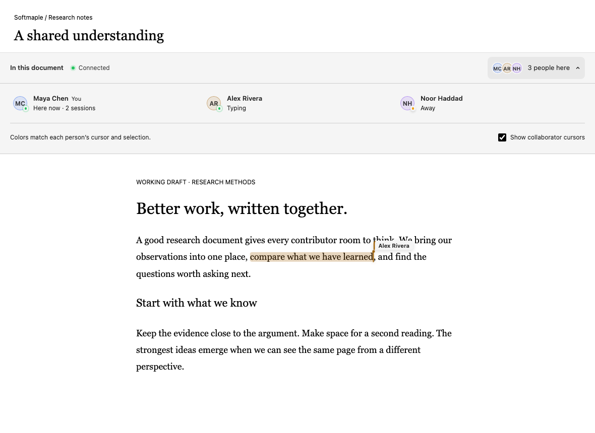
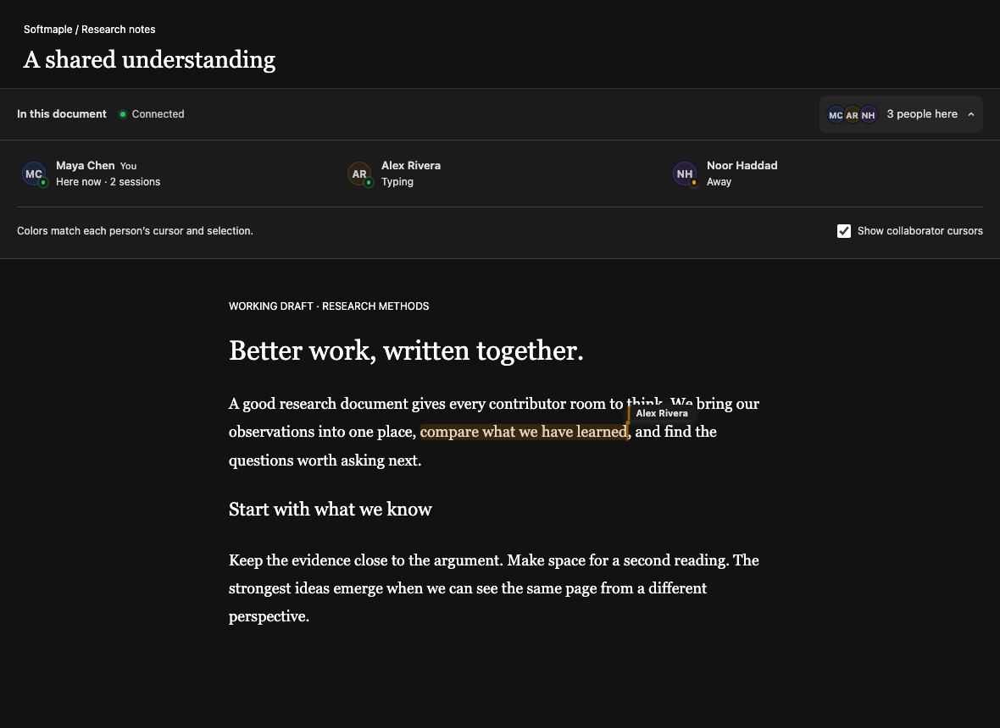

# Awareness & Presence Design Document

## 1. Overview

This document describes the design of **Awareness & Presence** in a real-time collaborative editor.

**Awareness & Presence** answers four fundamental user questions with minimal cognitive load:

1. **Who** is currently in the room?
2. **Where** are they in the document?
3. **What** are they doing (roughly)?
4. **Will it affect me?**

The system is designed to be **low-noise, non-blocking, and progressively disclosed**.

**Protocol version:** `2` (`PRESENCE_PROTOCOL_VERSION` in `@softmaple/awareness`).

---

## 2. Design Principles

### 2.1 Low Interruption by Default
- Awareness information should be **visible but ignorable**
- No blocking modals, no toast spam
- Strong signals only appear on hover, focus, or potential conflict

### 2.2 Approximation Over Precision
- Presence is **probabilistic**, not authoritative
- "Someone is editing here" is sufficient
- Exact keystrokes or real-time character updates are unnecessary

### 2.3 Layered Awareness
Information is presented in layers from coarse to fine:

| Layer | Question Answered |
|---|---|
| Global | Who is online? |
| Document | Who is in this document? |
| Section | Who is editing this part? |
| Action | What just happened? |

---

## 3. Non-Goals

The following are explicitly out of scope for the first iteration:

- Chat or messaging
- Audio / video presence
- Detailed activity logs
- Real-time keystroke mirroring
- Conflict resolution UI (handled at data layer)

---

## 4. Presence Model

### 4.1 Session Identity

```ts
interface PresenceUser {
  connectionId: string; // ephemeral per tab / device / socket
  userId: string;       // persistent account identity
  name: string;
  avatarUrl?: string;
  color: string;

  status: PresenceStatus; // derived
  lastActivityAt: number; // real user activity
  lastSeenAt: number;     // heartbeat / any transport frame
  clock: number;          // monotonic per-connection revision

  cursor?: CursorPosition; // offset and/or stable SequenceAnchor
  selection?: PresenceSelection;
  meta?: { isTyping?: boolean };
}
```

The presence map is keyed by `connectionId`. The same `userId` may appear as
multiple sessions (multiple tabs). UI may aggregate by `userId` later.

### 4.2 Status Rules (derived)

Status is **never** set by heartbeats. It is derived:

```text
now - lastSeenAt > offlineTimeout  → offline
now - lastActivityAt > idleTimeout → idle
otherwise                          → active
```

| Status | Definition |
|---|---|
| `active` | Recent user activity (`lastActivityAt`) |
| `idle` | Connected (seen) but no recent activity |
| `offline` | Heartbeat / transport liveness expired (`lastSeenAt`) |

Heartbeat may only update `lastSeenAt`. Cursor / selection / typing /
`markUserActivity` update `lastActivityAt` (and usually `lastSeenAt`).

`patchPresenceUser` never implicitly bumps timestamps.

### 4.3 Clocked Updates

Ephemeral presence is a per-connection versioned register:

```ts
{ connectionId, clock, updates }
```

Only `incoming.clock > known.clock` overwrites state. Stale frames may still
refresh `lastSeenAt`.

### 4.4 Cursor Positions

```ts
type CursorPosition =
  | { blockId: string; offset: number }                 // legacy / textarea
  | { blockId: string; anchor: SequenceAnchor; offset?: number }; // stable
```

Selections already use stable anchors; cursors should prefer the stable form
in EG-walker surfaces.

---

## 5. Transport Readiness

WebSocket `connect()` resolves only when presence is **ready**, not merely
when the socket opens:

```text
disconnected
  → connecting
  → authenticating   (auth → auth_ok; skipped if no authToken)
  → syncing          (join + presence:sync → sync-response)
  → connected        // presence session ready
```

Heartbeat:

```text
heartbeat { pingId } every ~10s
heartbeat:ack { pingId }
missed ACK deadline (default 20s, 2 misses) → force close → reconnect
```

---

## 6. UI Components

### 6.1 Document roster and presence primitives

`CollaborationBar` is the document-level composition used by the web editor.
Its compact row names the context, distinguishes presence connection from the
header's document-save state, and opens an inline roster. The expanded panel
shows one person per account, live session counts, “You”, and plain activity
labels. Self stays first, then names stay in alphabetical order while people
type. Offline sessions do not contribute to the count, and connection loss
hides the cached roster until presence is ready again.

The cursor visibility checkbox changes the local overlay only. It never stops
publishing the local selection or changes document editing permissions. The
panel uses one button in the tab order; Enter/Space toggle it and Escape inside
the panel closes it and returns focus. On small screens, the roster becomes a
single column. A scrollable roster bounds the height in crowded rooms.

The web editor uses `PresenceLayer`, `LiveCursor`, and `SelectionHighlight` with
its measured Lexical geometry. Cursor labels fade, carets match measured line
heights, and resizing the editor refreshes positions. Neutral name tags and
soft avatar tints retain readable text for pale participant colors; names
remain the primary identity when palette colors repeat.

Storybook review captures (the document prose is a preview fixture):





[Mobile capture](./assets/collaboration/mobile.png)

### 6.2 Presence Bar (Global Awareness)

**Purpose**  
Shows who is currently in the room.

**Behavior**
- Displays up to N avatars
- Overflow shown as `+X`
- Tooltip reveals name and status
- Sorted by recent activity (`lastActivityAt`)

### 6.3 Live Cursor (Local Awareness)

**Purpose**  
Indicates where another user is editing.

**Behavior**
- Colored caret
- Username label appears on movement
- Label fades out after 2-3 seconds
- Cursor movement is interpolated (no jitter)

### 6.4 Selection Highlight (Block Awareness)

**Purpose**  
Shows which block or range is being edited by others.

### 6.5 Activity Indicator (Action Awareness)

**Purpose**  
Communicates recent activity without distraction.

---

## 7. Performance Considerations

- **Network** cursor updates coalesced at **50ms** (~20 updates/s/user)
- Local rendering may still run at 60fps independently
- When WebSocket `bufferedAmount` is high, stale cursor frames are dropped
  (latest-value-wins)
- Off-screen cursors not rendered
- Presence is eventually consistent

---

## 8. Accessibility

- Non-blocking indicators
- Screen reader friendly
- Color is never the sole signal

---

## 9. Architecture

```text
                 PresenceStore / core
                /                    \
        Transport Adapter              React Provider
        (WS / BroadcastChannel)        (hooks / UI)
```

Adapters own connect / send / receive / reconnect.
Status derivation and clocked merges live in `packages/awareness/src/core/`.

---

## 10. Success Criteria

- Users feel confident editing together
- Idle is reachable while heartbeats continue
- Multi-tab same account does not self-suppress
- Minimal performance impact under multi-user cursor load

---

## 11. Summary

Awareness & Presence should create **calm confidence**, not excitement.

> "I know who's here, and I'm not surprised by their actions."
