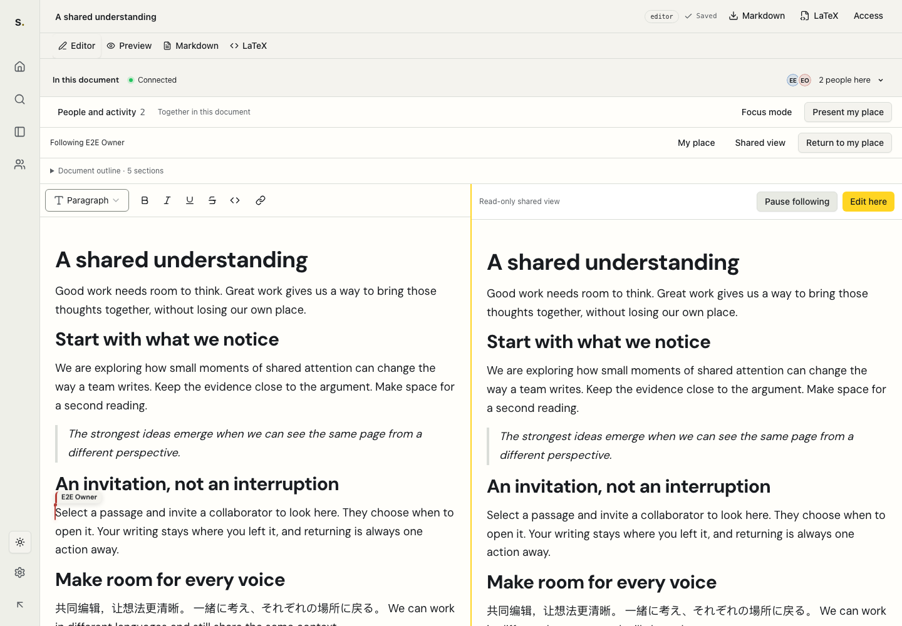

# Screenshot index

## PR review preview

This checked-in screenshot uses local seeded test accounts and shows the real
shared-attention journey, including the editable document and read-only shared view.

Review images are stored in ignored `.artifacts/redesign/` and use local seeded
content. Credentials and browser storage are separate private files and must not
be included in a public handoff. Final screenshots replace earlier temporary
milestone images lost when temporary storage was cleared.

## Final route milestone

Each row has 1440 × 1000 desktop and 390 × 844 mobile images in both themes.

| Route/surface | Desktop light | Desktop dark | Mobile light | Mobile dark |
| --- | --- | --- | --- | --- |
| account | [Light](../../.artifacts/redesign/milestone-routes/account-desktop-light.png) | [Dark](../../.artifacts/redesign/milestone-routes/account-desktop-dark.png) | [Light](../../.artifacts/redesign/milestone-routes/account-mobile-light.png) | [Dark](../../.artifacts/redesign/milestone-routes/account-mobile-dark.png) |
| dashboard | [Light](../../.artifacts/redesign/milestone-routes/dashboard-desktop-light.png) | [Dark](../../.artifacts/redesign/milestone-routes/dashboard-desktop-dark.png) | [Light](../../.artifacts/redesign/milestone-routes/dashboard-mobile-light.png) | [Dark](../../.artifacts/redesign/milestone-routes/dashboard-mobile-dark.png) |
| editor | [Light](../../.artifacts/redesign/milestone-routes/editor-desktop-light.png) | [Dark](../../.artifacts/redesign/milestone-routes/editor-desktop-dark.png) | [Light](../../.artifacts/redesign/milestone-routes/editor-mobile-light.png) | [Dark](../../.artifacts/redesign/milestone-routes/editor-mobile-dark.png) |
| empty-workspace | [Light](../../.artifacts/redesign/milestone-routes/empty-workspace-desktop-light.png) | [Dark](../../.artifacts/redesign/milestone-routes/empty-workspace-desktop-dark.png) | [Light](../../.artifacts/redesign/milestone-routes/empty-workspace-mobile-light.png) | [Dark](../../.artifacts/redesign/milestone-routes/empty-workspace-mobile-dark.png) |
| home | [Light](../../.artifacts/redesign/milestone-routes/home-desktop-light.png) | [Dark](../../.artifacts/redesign/milestone-routes/home-desktop-dark.png) | [Light](../../.artifacts/redesign/milestone-routes/home-mobile-light.png) | [Dark](../../.artifacts/redesign/milestone-routes/home-mobile-dark.png) |
| landing | [Light](../../.artifacts/redesign/milestone-routes/landing-desktop-light.png) | [Dark](../../.artifacts/redesign/milestone-routes/landing-desktop-dark.png) | [Light](../../.artifacts/redesign/milestone-routes/landing-mobile-light.png) | [Dark](../../.artifacts/redesign/milestone-routes/landing-mobile-dark.png) |
| login | [Light](../../.artifacts/redesign/milestone-routes/login-desktop-light.png) | [Dark](../../.artifacts/redesign/milestone-routes/login-desktop-dark.png) | [Light](../../.artifacts/redesign/milestone-routes/login-mobile-light.png) | [Dark](../../.artifacts/redesign/milestone-routes/login-mobile-dark.png) |
| members | [Light](../../.artifacts/redesign/milestone-routes/members-desktop-light.png) | [Dark](../../.artifacts/redesign/milestone-routes/members-desktop-dark.png) | [Light](../../.artifacts/redesign/milestone-routes/members-mobile-light.png) | [Dark](../../.artifacts/redesign/milestone-routes/members-mobile-dark.png) |
| new-document | [Light](../../.artifacts/redesign/milestone-routes/new-document-desktop-light.png) | [Dark](../../.artifacts/redesign/milestone-routes/new-document-desktop-dark.png) | [Light](../../.artifacts/redesign/milestone-routes/new-document-mobile-light.png) | [Dark](../../.artifacts/redesign/milestone-routes/new-document-mobile-dark.png) |
| not-found | [Light](../../.artifacts/redesign/milestone-routes/not-found-desktop-light.png) | [Dark](../../.artifacts/redesign/milestone-routes/not-found-desktop-dark.png) | [Light](../../.artifacts/redesign/milestone-routes/not-found-mobile-light.png) | [Dark](../../.artifacts/redesign/milestone-routes/not-found-mobile-dark.png) |
| public-reader | [Light](../../.artifacts/redesign/milestone-routes/public-reader-desktop-light.png) | [Dark](../../.artifacts/redesign/milestone-routes/public-reader-desktop-dark.png) | [Light](../../.artifacts/redesign/milestone-routes/public-reader-mobile-light.png) | [Dark](../../.artifacts/redesign/milestone-routes/public-reader-mobile-dark.png) |
| reset-password | [Light](../../.artifacts/redesign/milestone-routes/reset-password-desktop-light.png) | [Dark](../../.artifacts/redesign/milestone-routes/reset-password-desktop-dark.png) | [Light](../../.artifacts/redesign/milestone-routes/reset-password-mobile-light.png) | [Dark](../../.artifacts/redesign/milestone-routes/reset-password-mobile-dark.png) |
| signup | [Light](../../.artifacts/redesign/milestone-routes/signup-desktop-light.png) | [Dark](../../.artifacts/redesign/milestone-routes/signup-desktop-dark.png) | [Light](../../.artifacts/redesign/milestone-routes/signup-mobile-light.png) | [Dark](../../.artifacts/redesign/milestone-routes/signup-mobile-dark.png) |
| update-password | [Light](../../.artifacts/redesign/milestone-routes/update-password-desktop-light.png) | [Dark](../../.artifacts/redesign/milestone-routes/update-password-desktop-dark.png) | [Light](../../.artifacts/redesign/milestone-routes/update-password-mobile-light.png) | [Dark](../../.artifacts/redesign/milestone-routes/update-password-mobile-dark.png) |
| workspace-settings | [Light](../../.artifacts/redesign/milestone-routes/workspace-settings-desktop-light.png) | [Dark](../../.artifacts/redesign/milestone-routes/workspace-settings-desktop-dark.png) | [Light](../../.artifacts/redesign/milestone-routes/workspace-settings-mobile-light.png) | [Dark](../../.artifacts/redesign/milestone-routes/workspace-settings-mobile-dark.png) |

Additional editor captures: [1024 px](../../.artifacts/redesign/milestone-routes/editor-1024.png),
[320 px](../../.artifacts/redesign/milestone-routes/editor-320.png),
[200% CSS zoom](../../.artifacts/redesign/milestone-routes/editor-200-percent.png),
[forced colors](../../.artifacts/redesign/milestone-routes/editor-forced-colors.png).
CSS zoom is not a claim of browser chrome zoom verification.

## Real shared-attention milestone

Two independent authenticated accounts; no simulated participants. The landing
demonstration is the only simulated collaboration scene and is labeled in the UI.

| State | Desktop light | Desktop dark | Mobile light | Mobile dark |
| --- | --- | --- | --- | --- |
| invitation | [Light](../../.artifacts/redesign/milestone-attention/invitation-desktop-light.png) | [Dark](../../.artifacts/redesign/milestone-attention/invitation-desktop-dark.png) | [Light](../../.artifacts/redesign/milestone-attention/invitation-mobile-light.png) | [Dark](../../.artifacts/redesign/milestone-attention/invitation-mobile-dark.png) |
| following | [Light](../../.artifacts/redesign/milestone-attention/following-desktop-light.png) | [Dark](../../.artifacts/redesign/milestone-attention/following-desktop-dark.png) | [Light](../../.artifacts/redesign/milestone-attention/following-mobile-light.png) | [Dark](../../.artifacts/redesign/milestone-attention/following-mobile-dark.png) |
| returned | [Light](../../.artifacts/redesign/milestone-attention/returned-desktop-light.png) | [Dark](../../.artifacts/redesign/milestone-attention/returned-desktop-dark.png) | [Light](../../.artifacts/redesign/milestone-attention/returned-mobile-light.png) | [Dark](../../.artifacts/redesign/milestone-attention/returned-mobile-dark.png) |

Invitation screenshots show an undisturbed focused editor. Following shows the
read-only projection and explicit relationship controls. Returned shows the
original editable surface after closing shared context.

## Design rationale

- Shell: narrow rail keeps destinations accessible while preserving writing width.
- Home: bounded Field clusters expose pinning and recent work; List provides the
  equivalent compact destination set and controls.
- Editor: semantic save/live states, complete people roster, bounded overlays,
  calm prose and deliberate yellow attention seam.
- Secondary routes: consistent semantic surfaces, readable emphasis, accessible
  form hierarchy, public reading and recovery states.

Route capture assertions are in `milestone-routes/checks.json`; interaction
assertions are in `milestone-attention/checks.json`. See the validation report
for automated accessibility results and remaining manual acceptance.
